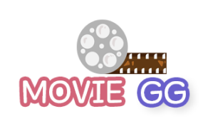

## 목차🔎
- [프로젝트 소개](#프로젝트-소개)
- [Member](#member)
- [역할](#역할)
- [개발 가이드라인](#개발-가이드라인)
- [스타일 가이드라인](#스타일-가이드라인)
- [Tech Stack](#tech-stack)
- [주요 기능 목록](#주요-기능-목록)
- [ERD & UI](#erd-&-ui)
- [캐릭터 고르기 알고리즘](#캐릭터-고르기-알고리즘)
- [마무리 소감](#마무리-소감)

## 프로젝트 소개🎞

>Welcome to the MOVIE GG  
>MOVIE GG는 다양한 방법으로 영화 추천을 제공합니다. 당신만의 League of Legends 캐릭터를 고르고, 캐릭터에 어울리는 영화 추천을 받아보세요.

## 역할🧙‍♂️

- **정동균** (팀장) : 영화 추천 알고리즘 설계 & 추천 기능 구현
- **최강현** (기술 고문) : 메인페이지 설계 & 게시판 기능 구현
- **허범** (PM) : 소셜 로그인 & 사용자 인증 기능 구현

## 개발 가이드라인💡

- 상시 회의를 통해 프로젝트의 완성도를 높입니다.
  - 평일은 9 to 6까지 필수, 이후 저녁에도 틈틈이 모여서 개발하기
  - 주말은 하루는 쉬고 하루 열심히 달리기🔥🔥
- 정해진 Git branch 전략을 통해 협업의 일관성을 유지합니다.

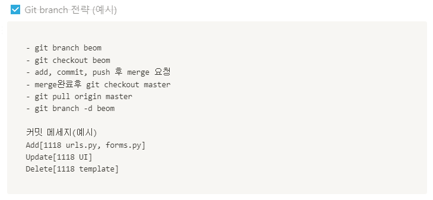

- 개발 일정을 준수하며, 이슈가 있을 시에는 즉각 공유하여 신속하게 해결합니다.

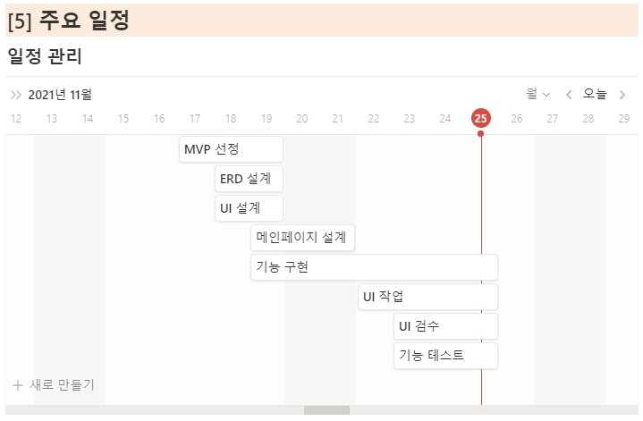

## 스타일 가이드라인🎨

- CSS 클래스 지정은 App 이름을 포함하여 충돌을 방지합니다.
- 길이, 높이, 테두리 등 세부 사항은 사전에 만든 UI 프로토 타입을 기준으로 지정합니다.
- 색은 사전에 만든 컬러 팔레트를 기준으로 지정합니다.

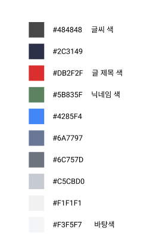

## Tech Stack💻

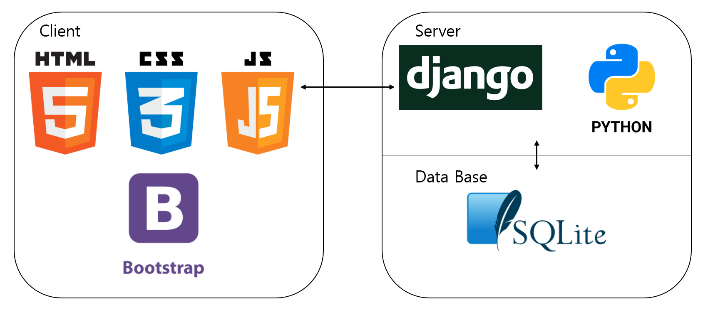

## 주요 기능 목록💪

- 네이버, 카카오, 구글, 깃헙 계정과 연동한 소셜 로그인 기능
- 이메일 인증을 통한 비밀번호 찾기 기능
- 영화 및 게시판 검색 기능
- 유저 레벨에 따른 권한 관리 기능
- 영화진흥위원회 API, TMDB API, 크롤링 등을 이용한 영화 추천 기능
- 캐릭터 고르기 테스트를 통한 영화 추천 기능

## ERD & UI✒

- ERD (Erdcloud)

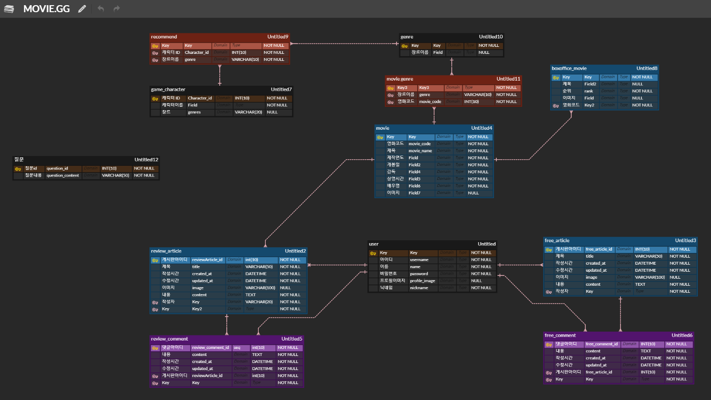

- UI (Figma)

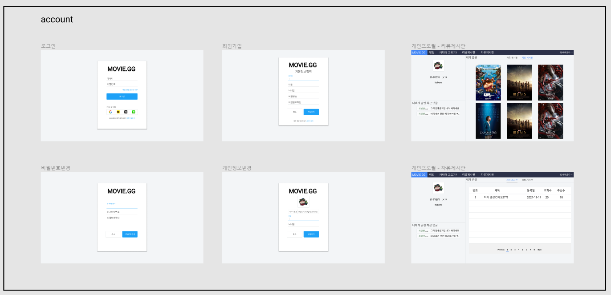

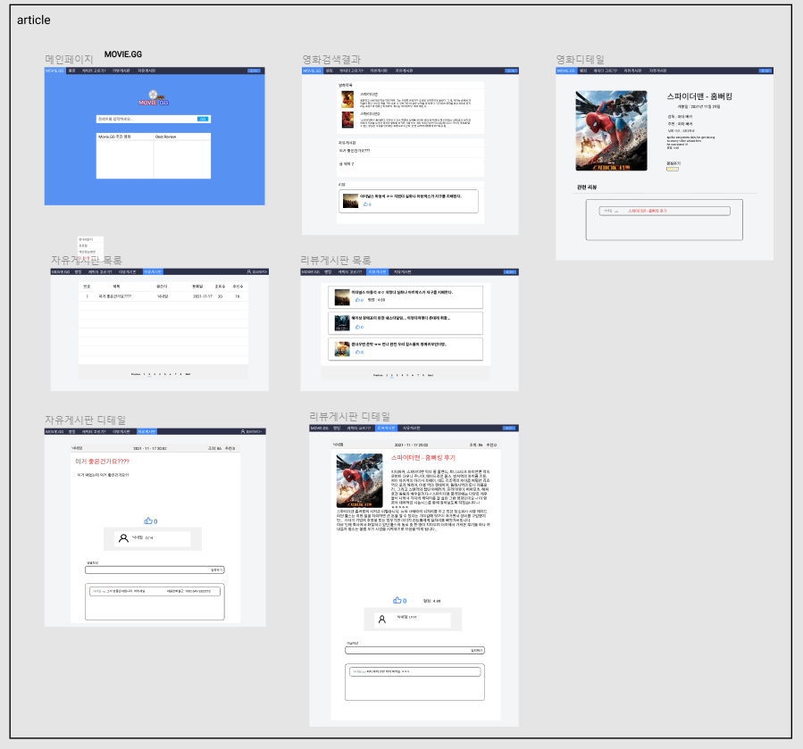

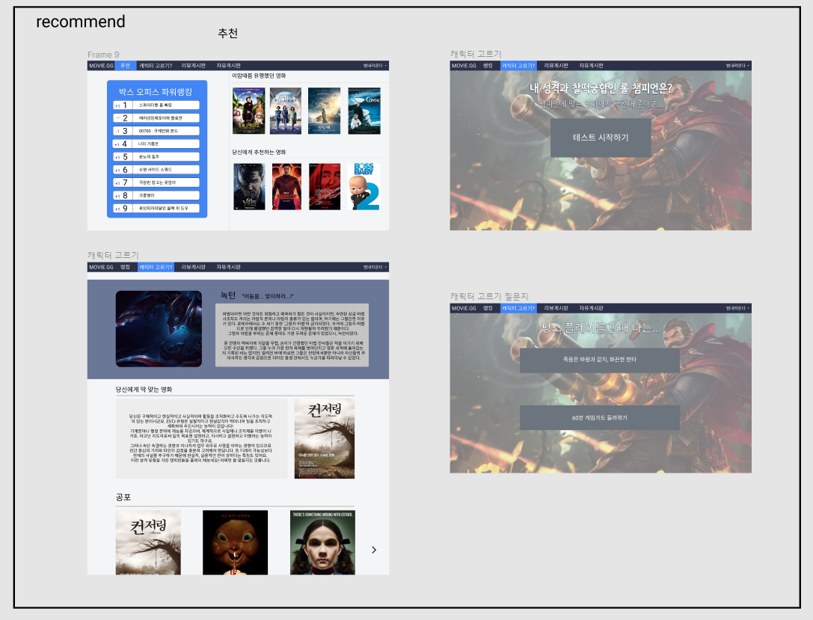

## 캐릭터 고르기 알고리즘📃

- 영화 추천 알고리즘 계획

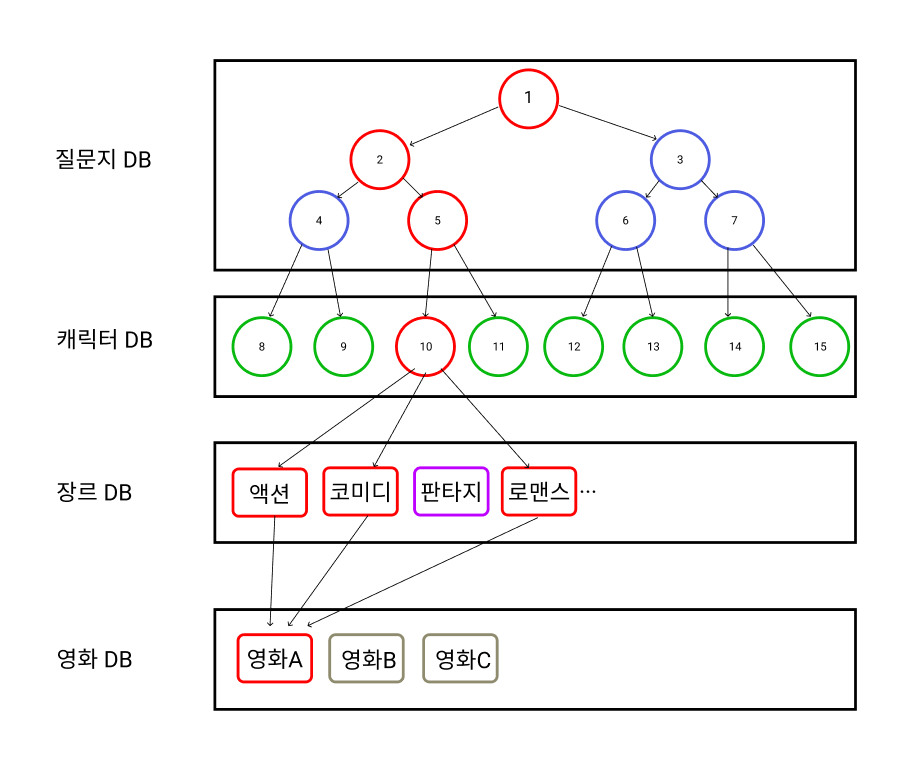

- 캐릭터 선정 및 장르 부여

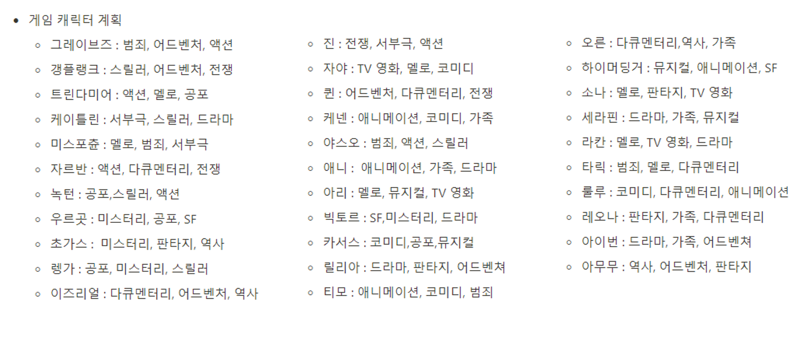

- 질문 선정

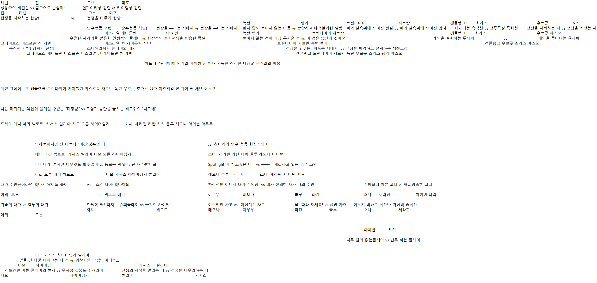

## 마무리 소감🏆

- 정동균 : 하루 종일 즐겁게 이야기하며 재미있게 프로젝트를 진행 하다 보니 프로젝트에도 욕심이 나고 투자하는 시간도 많아 졌던것 같았습니다. 혼자 하는 개발이 아닌 함께 협업하며 발생하는 오류나 시행착오들을 함께 해결해 나가는 과정이 함께 이기 때문에 더 즐겁고 수월 했던 것 같습니다. 아이디어가 많았는데 다 구현하지 못하는 기술적 한계가 아쉬워서 오늘부터 생각한 대로 만들 수 있는 실력을 갖추기 위해 더 정진 해야겠습니다.
- 최강현 : 좋은 팀원을 만나서 일주일 동안 즐겁게 프로젝트 할 수 있었습니다. 하다보니 자꾸 욕심이 생기는데 구현할 수가 없어서 실력을 더 키워야겠다는 생각을 했습니다.
- 허범 : 같이 하고 싶은 팀원들과 함께 프로젝트를 할 수 있어서 일주일이 금방 지났습니다. 서로 막히는 부분이 있으면 공유하면서 문제를 해결하는 것이 함께하는 개발임을    느낄 수 있었고, 더욱 개발실력 또한 키워야겠다고 생각이 든 일주일이었습니다.
